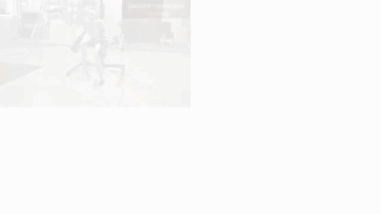

<p align="center">
  <h1 align="center"><strong>ULTRA: Unified Multimodal Control for Autonomous Humanoid Whole-Body Loco-Manipulation</strong></h1>
  <p align="center">
    <a href="https://xialin-he.github.io/" target="_blank">Xialin He</a><sup>*</sup>&emsp;
    <a href="https://sirui-xu.github.io/" target="_blank">Sirui Xu</a><sup>*</sup>&emsp;
    <a href="https://lixinyao11.github.io/" target="_blank">Xinyao Li</a>&emsp;
    <a href="https://runpeidong.web.illinois.edu/" target="_blank">Runpei Dong</a>&emsp;
    <a href="https://scholar.google.com/citations?user=J2z-0lgAAAAJ&hl=en" target="_blank">Liuyu Bian</a>&emsp;
    <a href="https://yxw.cs.illinois.edu/" target="_blank">Yu-Xiong Wang</a><sup>&dagger;</sup>&emsp;
    <a href="https://lgui.cs.illinois.edu/" target="_blank">Liang-Yan Gui</a><sup>&dagger;</sup>
    <br>
    University of Illinois Urbana-Champaign
    <br>
    <sup>*</sup>Equal contribution&emsp;<sup>&dagger;</sup>Equal advising
    <br>
    <strong>IROS 2026 &middot; Best Paper Award on Mobile Manipulation &middot; Finalist 🏆</strong>
  </p>
</p>

<p align="center">
  <a href='https://arxiv.org/abs/2603.03279'>
    </a>
  <a href='https://arxiv.org/pdf/2603.03279'>
    </a>
  <a href='https://ultra-humanoid.github.io/'>
    </a>
  <a href='https://github.com/Sirui-Xu/ULTRA'>
    </a>
</p>

## 🏠 Overview

<div align="center">
  
</div>

> **ULTRA** is a single multimodal controller for humanoid whole-body loco-manipulation: it tracks a motion reference when one is available, and acts from egocentric perception and a sparse goal when it is not — one policy, one set of weights, on a real Unitree G1.

## ⚙️ Installation

See [docs/install.md](docs/install.md): Python 3.11, Isaac Sim 5.1, Isaac Lab 2.3.x (fork, which also provides
rl-games), PyTorch 2.7.0 + CUDA 12.8 (required for RTX 50xx GPUs), `pip install -r requirements.txt`, and `mujoco` for
sim2sim. Convert the assets to USD once with `python scripts/convert_assets.py`. Run every command below from the
repository root; on a 16 GB GPU add `--num_envs 2048` to the training commands.

## 📦 Data

| Download | Used for | Extract `.pt` files to |
| --- | --- | --- |
| [InterMimic prepared OMOMO references](https://drive.google.com/file/d/1l2E5qR97Ap8jrLrJPHmtNT8DDW1qKhY_/view?usp=sharing) | SMPL-X retargeting input · `[T, 591]` | `InterAct/OMOMO_retarget/` |
| [ULTRA retargeted and augmented data](https://drive.google.com/file/d/1g6OzxXGJczZ4klVqKCpTzy-orKkllCr4/view?usp=sharing) | G1 teacher/student training · `[T, 630]` | `InterAct/OMOMO_retarget_aug/` |

The released G1 archive contains **OMOMO physics-based retargeted and augmented motions**. The source archive follows [InterMimic's data format](https://github.com/Sirui-Xu/InterMimic#data).

<details>
<summary>Data layout and supported objects</summary>

Place the `.pt` files directly in the directories above. ULTRA includes assets for `largebox`, `plasticbox`, `smallbox`, and `suitcase`; the retargeting script selects motions for these objects.

</details>

## 🚀 Reproduce the pipeline

| Stage | Input → output | Entry point |
| --- | --- | --- |
| 1 · Retarget | Prepared OMOMO SMPL-X → G1 policy | `scripts/train_retarget_smplx.sh` |
| 2 · Augment | SMPL-X + trained policy → G1 rollouts | `scripts/export_retarget_smplx.py` |
| 3 · Train teacher | G1 rollouts → tracking policy | `scripts/train_teacher.sh` |
| 4 · Distill student | G1 rollouts + included teacher → student | `scripts/train_student.sh` |
| 5 · Finetune student | Distilled student → goal-directed policy | `scripts/train_finetune.sh` |

<details>
<summary><strong>1 · Train the retargeting policy</strong></summary>

After extracting the InterMimic `OMOMO_retarget` archive, run from the repository root:

```bash
scripts/train_retarget_smplx.sh
```

The script prepares supported object clips in `InterAct/OMOMO_retarget_supported_080_080_080/` and trains `UltraG1` with **position target PD control**. This data generation stage has no domain randomization, random pushes, or observation noise.

The configuration runs up to 50,000 epochs and writes checkpoints to `output/retarget_smplx/g1_retarget_smplx/nn/`.

</details>

<details>
<summary><strong>2 · Export retargeted and augmented G1 motion</strong></summary>

Use a trained retargeting checkpoint to replay the prepared references. `--xyz X Y Z` scales the sparse trajectories along each axis; repeat it for augmentation variants. `--asset-scale` selects an available object size (`080_080_080` or `100_100_100`).

```bash
python scripts/export_retarget_smplx.py \
  --input-dir InterAct/OMOMO_retarget \
  --checkpoint output/retarget_smplx/g1_retarget_smplx/nn/g1_retarget_smplx.pth \
  --output-dir output/retarget_export_080 \
  --asset-scale 080_080_080 \
  --xyz 1 1 1 --xyz 1.05 1 0.95

# Repeat with the larger released object assets.
python scripts/export_retarget_smplx.py \
  --input-dir InterAct/OMOMO_retarget \
  --checkpoint output/retarget_smplx/g1_retarget_smplx/nn/g1_retarget_smplx.pth \
  --output-dir output/retarget_export_100 \
  --asset-scale 100_100_100 \
  --xyz 1 1 1 --xyz 1.05 1 0.95
```

The exporter writes the resulting G1 motions to the chosen output directory. The released `InterAct/OMOMO_retarget_aug/` archive is ready to use for teacher training.

</details>

<details>
<summary><strong>3–4 · Train a teacher and distill the student</strong></summary>

```bash
# Teacher — dense full-body tracking (PPO, 4096 envs). Output: output/teacher/g1_teacher/nn/
scripts/train_teacher.sh

# Student — multimodal distillation from the included teacher checkpoint.
scripts/train_student.sh
NUM_GPUS=4 scripts/train_student_multigpu.sh          # torchrun, single node
```

The teacher uses `InterAct/OMOMO_retarget_aug/` by default. Pass `--motion_file <directory>` to train on another G1 motion directory.

</details>

<details>
<summary><strong>5 · Finetune the student</strong></summary>

Start RL finetuning from a distilled student checkpoint:

```bash
scripts/train_finetune.sh <student.pth>
```

The finetuning configuration uses `InterAct/OMOMO_retarget_aug/` and the included tracking teacher by default.

</details>

## 🎮 Inference

### 🧠 Tracking teacher

The included checkpoint at `ultra/weights/teacher_ultra_inference.pth` is used for student distillation and inference. See the [model card](docs/teacher-model-card.md) for its training data and use terms.

For the released checkpoint, we further trained on AMASS and BONES-SEED alongside OMOMO after the original work. The training code in this repository follows the original OMOMO setting.

<details>
<summary>Run teacher inference</summary>

```bash
# Put one retargeted G1 .pt clip in /absolute/path/to/one_motion_dir.
python ultra/run_teacher_inference.py --motion-dir /absolute/path/to/one_motion_dir
```

The command writes `output/teacher_inference/rollout.pt` with observed/reference states and actions from the motion. Use `--checkpoint <teacher.pth>` for another tracking teacher or change `env.teacherPolicy` in `ultra/data/cfg/g1_student_vae.yaml` for distillation.

</details>

### 🤖 Student

```bash
scripts/play_student.sh <student.pth> 1 full_track      # Isaac Lab playback (also: sparse_track, object_obs points)
scripts/sim2sim_student.sh <student.pth> InterAct/OMOMO_retarget_aug full_track   # MuJoCo
scripts/export_jit.sh <student.pth> student_jit.pt      # TorchScript export
```

## 📄 License

ULTRA's own code is released under Apache-2.0 (top-level `LICENSE`); the InterMimic-derived simulation and learning
stack is under MIT (`LICENSE-InterMimic`). `ultra/utils/gym_torch_utils.py` reproduces NVIDIA's IsaacGym torch
helpers and keeps NVIDIA's header. Robot assets are from Unitree; motion data derives from OMOMO
through InterAct.

## 📖 Citation

```bibtex
@inproceedings{he2026ultra,
  title     = {ULTRA: Unified Multimodal Control for Autonomous Humanoid Whole-Body Loco-Manipulation},
  author    = {He, Xialin and Xu, Sirui and Li, Xinyao and Dong, Runpei and Bian, Liuyu and Wang, Yu-Xiong and Gui, Liang-Yan},
  booktitle = {IEEE/RSJ International Conference on Intelligent Robots and Systems (IROS)},
  year      = {2026}
}
```
