# ULTRA: Ablauf durch den Code, Stufe für Stufe

Mermaid-Diagramme zum Stand von `feature/isaaclab-port` (inklusive der Fixes vom 01./02.10.2026). Die Erklärung im Fliesstext steht in [`PIPELINE_ERKLAERUNG_ISAACLAB.md`](PIPELINE_ERKLAERUNG_ISAACLAB.md).

Alle Befehle laufen aus dem Repo-Root im Conda-Env `ultra` (`OMNI_KIT_ACCEPT_EULA=YES` setzen). Auf einer 16-GB-GPU hängt man an jeden Trainingsbefehl `--num_envs 2048` an.

Lesehilfe: Kästen sind Dateien bzw. Funktionen (`datei.py: Klasse.methode`), Pfeile die Aufrufreihenfolge. Gestrichelte Pfeile sind Daten, die eine Stufe für die nächste schreibt.

## Inhalt

1. [Übersicht der Stufen](#1-übersicht-der-stufen)
2. [Gemeinsamer Start in `run.py`](#2-gemeinsamer-start-in-runpy)
3. [Aufbau einer Umgebung](#3-aufbau-einer-umgebung)
4. [Ein Policy-Schritt](#4-ein-policy-schritt)
5. [Stufe 0: Assets konvertieren](#5-stufe-0-assets-konvertieren)
6. [Stufe 1: Retargeting trainieren](#6-stufe-1-retargeting-trainieren)
7. [Stufe 2: Export nach `[T, 630]`](#7-stufe-2-export-nach-t-630)
8. [Stufe 3: Teacher trainieren](#8-stufe-3-teacher-trainieren)
9. [Stufe 4: Student destillieren](#9-stufe-4-student-destillieren)
10. [Stufe 5: Student finetunen](#10-stufe-5-student-finetunen)
11. [Abspielen und Inferenz](#11-abspielen-und-inferenz)

---

## 1. Übersicht der Stufen

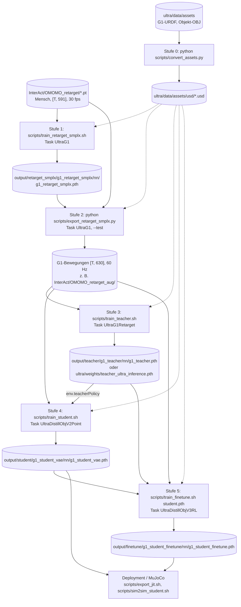

| Stufe | Start | Task-Klasse | Agent |
|---|---|---|---|
| 0 | `python scripts/convert_assets.py [--force]` | – | – |
| 1 | `scripts/train_retarget_smplx.sh --num_envs 2048` | `UltraG1` | `UltraAgent` (PPO) |
| 2 | `python scripts/export_retarget_smplx.py --input-dir … --checkpoint … --output-dir … --xyz 1 1 1` | `UltraG1` | `UltraPlayerContinuous` |
| 3 | `scripts/train_teacher.sh --num_envs 2048` | `UltraG1Retarget` | `UltraAgent` (PPO) |
| 4 | `scripts/train_student.sh --num_envs 2048` | `UltraDistillObjV2Point` | `UltraAgentDistill` (DAgger/VAE) |
| 5 | `scripts/train_finetune.sh <student.pth> --num_envs 2048` | `UltraDistillObjV3RL` | `UltraAgentDistill` (Distillation + PPO) |

Stufe 3 ist optional, wenn man den mitgelieferten Teacher `ultra/weights/teacher_ultra_inference.pth` nimmt; Stufen 1 und 2 sind optional, wenn man das veröffentlichte Archiv `OMOMO_retarget_aug` nimmt.

---

## 2. Gemeinsamer Start in `run.py`

Alle Stufen ausser 0 laufen durch `ultra/run.py` (`run_distill.py` ist nur ein Alias darauf). Die Shell-Skripte unterscheiden sich nur in `--task`, den beiden YAML-Dateien und `--output_path`.

```mermaid
flowchart TD
    sh["scripts/*.sh<br/>python ultra/run.py --task ... --cfg_env ... --cfg_train ..."]

    subgraph start ["ultra/run.py, Modulebene"]
        jit["os.environ PYTORCH_JIT=0<br/>vor jedem torch-Import"]
        argp["utils/config.py: get_args_parser<br/>+ AppLauncher.add_app_launcher_args"]
        app["AppLauncher(args)<br/>startet Isaac Sim / Kit"]
        fin["utils/config.py: finalize_args<br/>--test setzt train=False"]
        imp["Imports: rl_games, torch,<br/>isaac.vec_task, learning.ultra_models"]
        reg["vecenv.register('RLGPU')<br/>env_configurations.register('rlgpu')"]
        jit --> argp --> app --> fin --> imp --> reg
    end

    subgraph mainf ["ultra/run.py: main"]
        lc["utils/config.py: load_cfg<br/>Env-YAML + PPO-YAML laden,<br/>--num_envs, --checkpoint, --max_iterations"]
        ov["CLI-Overrides ins cfg schreiben<br/>--motion_file, --resume_from, train_dir = --output_path"]
        wb["wandb.init, ausser WANDB_DISABLED=true"]
        bar["build_alg_runner<br/>Agent, Player, Netz je nach Task wählen"]
        rl["Runner.load(cfg_train)<br/>Runner.reset()"]
        rr["Runner.run(vargs)"]
        lc --> ov --> wb --> bar --> rl --> rr
    end

    sh --> jit
    reg --> lc

    rr -->|"train"| tr["Runner.run_train: Agent anlegen<br/>A2CBase.__init__ → vecenv.create_vec_env"]
    rr -->|"--test"| pl["Runner.run_play: Player anlegen<br/>BasePlayer.__init__ → create_env"]
    tr --> env["run.py: RLGPUEnv.__init__"]
    env --> cre["run.py: create_rlgpu_env<br/>Seed + Rang, cuda:LOCAL_RANK"]
    pl -->|"direkt, ohne RLGPUEnv"| cre
    cre --> pt["utils/parse_task.py: parse_task<br/>(Kapitel 3)"]
    pt --> rst["nur Training: RLGPUEnv.reset()<br/>erster Reset aller Envs"]
    pt --> player["Player.restore(checkpoint)<br/>Player.run()"]
    rst --> agent["Agent.train()<br/>(Stufen 1, 3, 4, 5)"]
    agent --> close["task.close()<br/>simulation_app.close() beendet den Prozess"]
    player --> close
```

`build_alg_runner` wählt die Klassen nach Task:

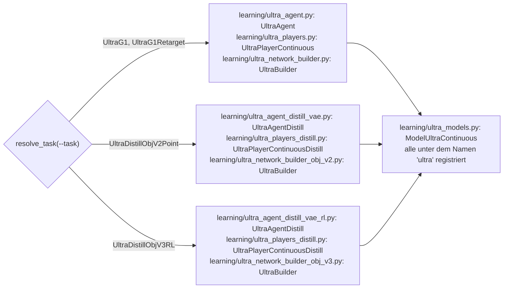

---

## 3. Aufbau einer Umgebung

`parse_task` erzeugt die Isaac-Lab-Umgebung. Der Konstruktor läuft durch die Mehrfachvererbung `UltraG1 → Humanoid_G1 → Ultra → Humanoid_SMPLX → UltraBaseEnv → DirectRLEnv`; jede Klasse macht einen Teil vor und einen Teil nach `super().__init__`. Für Teacher und Student ist die Kette gleich, nur steht `UltraG1Retarget` bzw. die Student-Klasse vorne.

```mermaid
flowchart TD
    pt["utils/parse_task.py: parse_task"]
    pt --> rt["resolve_task, register_tasks<br/>gymnasium-IDs registrieren"]
    rt --> mk["isaac/scene_cfg.py: make_env_cfg<br/>YAML-Dict → UltraEnvCfg,<br/>build_sim_cfg: dt = 1 ms, decimation = 17, PhysX"]
    mk --> gm["gym.make(id, cfg) → Task-Klasse"]

    subgraph ctor ["Konstruktor, von aussen nach innen"]
        c1["env/tasks/ultra_g1.py: UltraG1.__init__"]
        c2["env/tasks/humanoid_g1.py: Humanoid_G1.__init__<br/>keyIndex, contactIndex"]
        c3["env/tasks/ultra.py: Ultra.__init__<br/>Motion-Dateien auflisten,<br/>Objektnamen aus Dateinamen, object_id"]
        c4["env/tasks/humanoid.py: Humanoid_SMPLX.__init__<br/>YAML lesen, numObs, numActions"]
        c5["isaac/base_env.py: UltraBaseEnv.__init__"]
        c1 --> c2 --> c3 --> c4 --> c5
    end

    gm --> c1

    subgraph base ["UltraBaseEnv.__init__"]
        b1["scene_cfg.py: finalize_env_cfg<br/>build_robot_cfg: G1-USD + ImplicitActuatorCfg<br/>build_object_cfg: Objekt-USDs, Env i → Objekt i % n<br/>ContactSensorCfg, TerrainImporterCfg"]
        b2["DirectRLEnv.__init__<br/>SimulationContext, InteractiveScene klonen,<br/>_setup_scene (Licht), sim.reset()"]
        b3["_build_index_maps<br/>Legacy-Reihenfolge ↔ Isaac Lab<br/>(isaac/legacy_layout.py)"]
        b4["_allocate_state_tensors<br/>_root_states, _dof_state, _rigid_body_state, ..."]
        b5["_allocate_task_buffers<br/>obs_buf, rew_buf, reset_buf, progress_buf"]
        b6["_check_object_assignment"]
        b7["UltraViewer, nur ohne --headless"]
        b8["_setup_env_properties"]
        b9["_refresh_sim_tensors"]
        b1 --> b2 --> b3 --> b4 --> b5 --> b6 --> b7 --> b8 --> b9
    end

    c5 --> b1

    subgraph props ["UltraG1._setup_env_properties"]
        p1["Ultra._load_target_asset<br/>trimesh: 256 Oberflächenpunkte pro Objekt"]
        p2["Humanoid_G1._setup_env_properties<br/>Fuss/Knie/Torso-Indizes, Gelenkgrenzen,<br/>PD-Gains, Reibung, Torso-Masse"]
        p3["Ultra._setup_target_properties<br/>Objektmaterial"]
        p1 --> p2 --> p3
    end

    b8 --> p1

    subgraph back ["zurück aus super().__init__, von innen nach aussen"]
        r1["Humanoid_SMPLX: Views auf die Legacy-Tensoren,<br/>_key_body_ids, _contact_body_ids"]
        r2["Ultra: _load_motion (Stufe 1: UltraG1._load_motion),<br/>_build_target_tensors"]
        r3["Humanoid_G1: Aktionspuffer, SmoothRewards"]
        r4["UltraG1: scaling, initRootHeight, init_dof"]
        r1 --> r2 --> r3 --> r4
    end

    b9 --> r1
    r4 --> wr["isaac/vec_task.py: UltraVecTask<br/>(Student-Tasks: UltraDAggerVecTask)"]
```

---

## 4. Ein Policy-Schritt

Gleich für alle Stufen; die Unterschiede stecken in den Methoden, die die Task-Klassen überschreiben.

```mermaid
flowchart TD
    ag["Agent.play_steps, Schleife über horizon_length"]
    ag --> er["env_reset(done_indices)<br/>→ RLGPUEnv.reset → UltraVecTask.reset → task.reset"]
    er --> rs["Humanoid_SMPLX._reset_envs, nur fertige Envs"]

    subgraph reset ["Reset"]
        ra["_reset_actors<br/>Motion und Startframe wählen (stateInit),<br/>_set_env_state: Roboter, _reset_target: Objekt"]
        rb["_reset_env_tensors<br/>base_env: _set_actor_root_state_indexed,<br/>_set_dof_state_indexed → write_*_to_sim"]
        rc["_refresh_sim_tensors"]
        rd["_compute_observations(env_ids)"]
        ra --> rb --> rc --> rd
    end

    rs --> ra
    rd --> act["get_action_values: Netz → Aktion"]
    act --> es["env_step → UltraVecTask.step<br/>Aktion auf [-1, 1] begrenzen"]
    es --> st["isaac/base_env.py: UltraBaseEnv.step"]

    st --> pre["pre_physics_step<br/>Aktion speichern, Aktionsverzögerung (DR)"]
    pre --> phy["Humanoid_SMPLX._physics_step"]

    subgraph substeps ["17 x pro Policy-Schritt"]
        ctl{"retargetPositionControl?"}
        pos["_apply_dof_position_targets<br/>Ziel aus _action_to_pd_targets"]
        tor["_compute_torques: kp·(3a − q) − kd·q̇<br/>_apply_dof_efforts"]
        sim["base_env: _simulate<br/>write_data_to_sim → sim.step → scene.update"]
        ref["_refresh_sim_tensors<br/>Isaac Lab → Legacy-Tensoren"]
        ctl -->|"ja (Stufe 1, 2)"| pos --> sim
        ctl -->|"nein (Stufe 3, 4, 5)"| tor --> sim
        sim --> ref
    end

    phy --> ctl
    ref --> post["post_physics_step"]

    subgraph postp ["post_physics_step"]
        q1["progress_buf += 1"]
        q2["Stösse, Schwerkraft (nur mit DR)"]
        q3["_compute_hoi_observations"]
        q4["_compute_observations"]
        q5["_compute_reward"]
        q6["_compute_reset → reset_buf, _terminate_buf"]
        q1 --> q2 --> q3 --> q4 --> q5 --> q6
    end

    post --> q1
    q6 --> back["obs, reward, done, extras zurück an den Agenten"]
    back --> ag
```

---

## 5. Stufe 0: Assets konvertieren

**Start:** `python scripts/convert_assets.py` (einmalig; `--force` nach Änderungen an URDF oder Meshes).

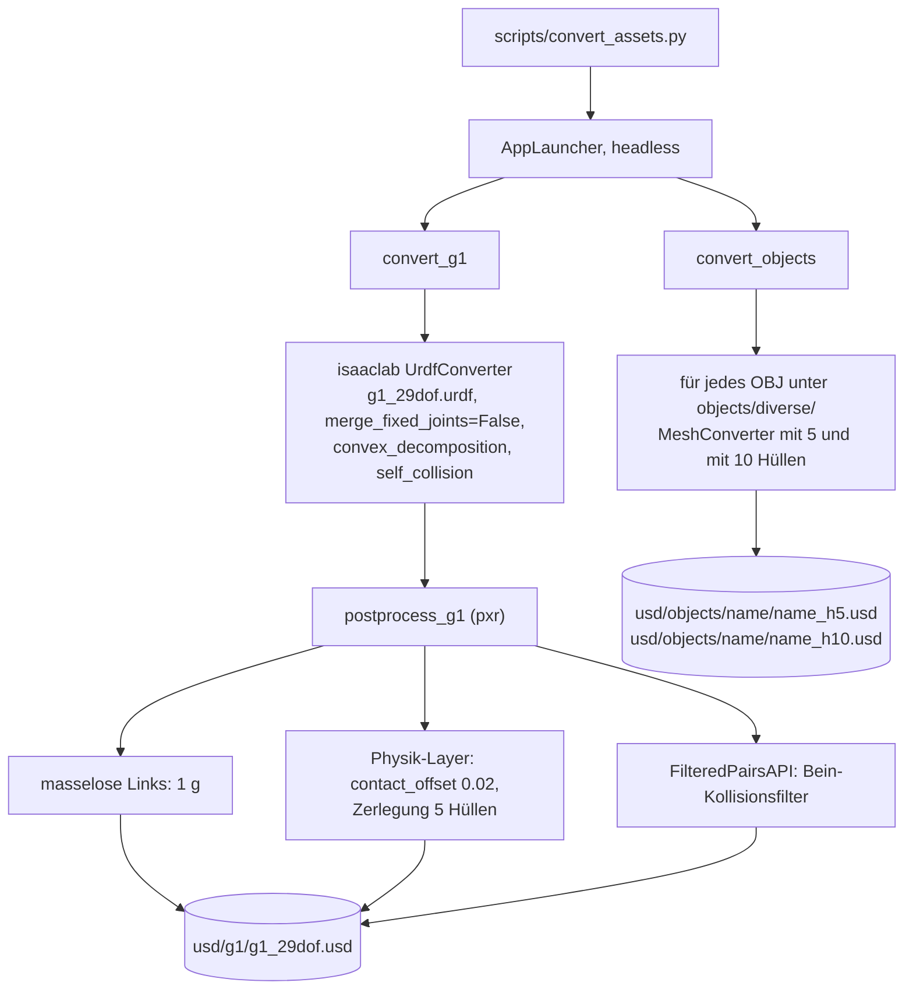

Prüfen: `python -u scripts/check_layout.py` muss mit `PASSED` enden.

---

## 6. Stufe 1: Retargeting trainieren

**Start:** `scripts/train_retarget_smplx.sh --num_envs 2048`
(Umgebungsvariablen `RAW_MOTION_DIR`, `ASSET_SCALE`, `PREPARED_MOTION_DIR` optional.)

**Konfiguration:** `ultra/data/cfg/g1_retarget_smplx.yaml`, `ultra/data/cfg/train/rlg/g1_retarget_smplx.yaml`

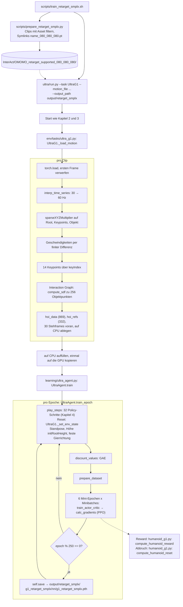

Während des Trainings: `progress_buf` zählt den Referenzframe; `_compute_observations` liefert 1853 Werte (Referenz t+1 und t+16); Positionsziele gehen an den impliziten PD-Regler von PhysX.

---

## 7. Stufe 2: Export nach `[T, 630]`

**Start:**

```bash
python scripts/export_retarget_smplx.py \
  --input-dir InterAct/OMOMO_retarget \
  --checkpoint output/retarget_smplx/g1_retarget_smplx/nn/g1_retarget_smplx.pth \
  --output-dir output/retarget_export_080 \
  --asset-scale 080_080_080 \
  --xyz 1 1 1 --xyz 1.05 1 0.95
```

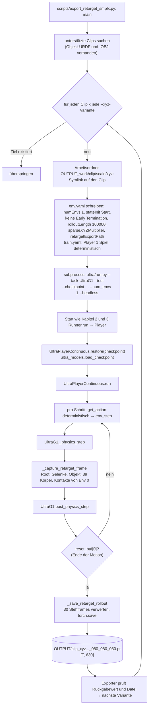

Pro Clip und Variante startet Isaac Sim einmal neu.

---

## 8. Stufe 3: Teacher trainieren

**Start:** `scripts/train_teacher.sh --num_envs 2048` (Daten: `env.motion_file` in `g1_teacher.yaml`, Standard `InterAct/OMOMO_retarget_aug`, oder `--motion_file <ordner>`).

**Konfiguration:** `ultra/data/cfg/g1_teacher.yaml`, `ultra/data/cfg/train/rlg/g1_teacher.yaml`

Gleiche Kette wie Stufe 1; die Unterschiede liegen in `env/tasks/ultra_g1_retarget.py`:

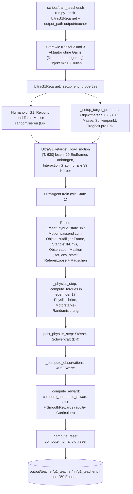

---

## 9. Stufe 4: Student destillieren

**Start:** `scripts/train_student.sh --num_envs 2048`, mehrere GPUs: `NUM_GPUS=4 scripts/train_student_multigpu.sh` (torchrun, `--multi_gpu`).

**Konfiguration:** `ultra/data/cfg/g1_student_vae.yaml` (`env.teacherPolicy`), `ultra/data/cfg/train/rlg/g1_student_vae.yaml`

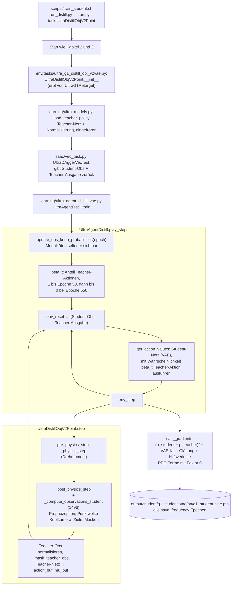

---

## 10. Stufe 5: Student finetunen

**Start:** `scripts/train_finetune.sh <student.pth> --num_envs 2048`

**Konfiguration:** `ultra/data/cfg/g1_student_finetune.yaml`, `ultra/data/cfg/train/rlg/g1_student_finetune.yaml`

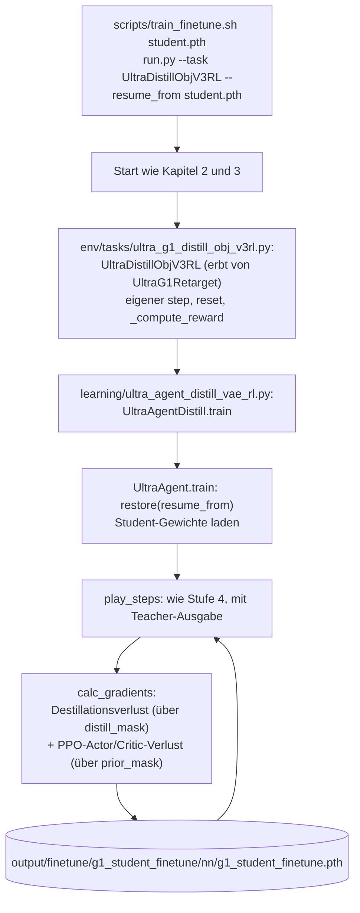

---

## 11. Abspielen und Inferenz

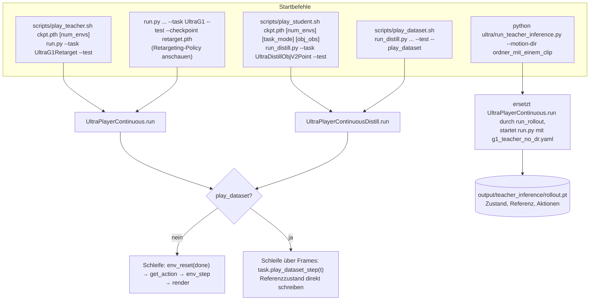

Mit Fenster: `--headless` weglassen und wenige Envs wählen (Rendern verlangsamt stark). MuJoCo statt Isaac Lab: `scripts/sim2sim_teacher.sh`, `scripts/sim2sim_student.sh`; TorchScript-Export für das Deployment: `scripts/export_jit.sh`.
